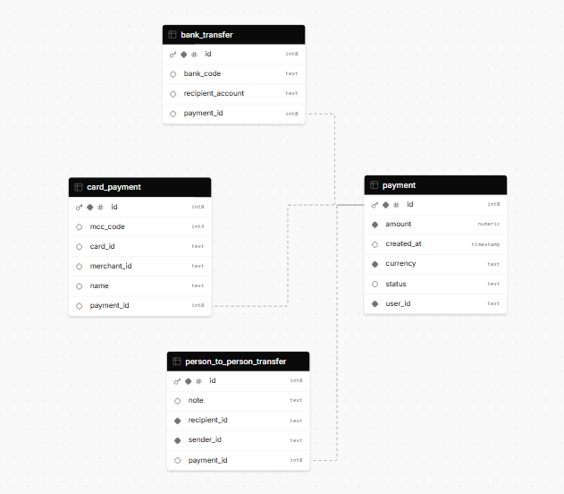

# Proyecto: payments
API REST en Java 17 con el framework de Spring boot
<h2>spring-boot-3</h2>

Comando para correr: mvnw spring-boot:run

 
 **Consideracion:** Actualmente está utilizando una base de datos de Google Cloud
 

<h2>Estrucctura del proyecto</h2>

src/main/java/com/rlink/payments
   ├── controller          # Controladores de la API (Capa Controlador)
   ├── dto                 # Clases DTO para transferir datos   
   ├── exception           # Manejo de excepciones personalizadas
   ├── mapper              # Para mapear el body del request   
   ├── model               # Entidades de datos (Capa Modelo)
   ├── repository          # Repositorios (Capa de Persistencia de Datos)
   ├── service             # Lógica de Negocio (Capa Servicio)
   └── utils               # En este caso lo utilice para dejar un catalogo de errores
   
src/main/java/resources 
      └──  application.yml    # Configuración del proyecto

<h2>Diagrama de entidad relacion</h2>

<h3>Endpoints</h3>
<h4>Post http://localhost:8080/api/payments/create</h4>
<h5>JSON de Ejemplo para las Solicitudes</h5>
Aquí hay ejemplos de JSON para cada tipo de pago. Estos JSON deben incluir el campo paymentType para que Jackson pueda identificar la subclase concreta.

JSON para CardPayment

{
"paymentType": "CardPayment",
"user_id": "113411",
"amount": 100,
"currency": "USD",
"card_id": "43211234",
"merchant": {
"name": "Amazon",
"merchant_id": "12309"
},
"mcc_code": 5411
}

JSON para BankTransfer

{
"paymentType": "BankTransfer",
"user_id": "113411",
"amount": 215,
"currency": "EUR",
"bank_code": "BANK123",
"recipient_account": "DE89370400440532013000"
}

JSON para PersonToPersonTransfer

{
"paymentType": "PersonToPersonTransfer",
"user_id": "113411",
"amount": 100,
"currency": "USD",
"sender_id": "113411",
"recipient_id": "113412",
"note": "Cena en restaurante"
}

<h4>GET http://localhost:8080/api/payments/{paymentsId}/status</h4>

<h4>GET http://localhost:8080/api/payments/user/{userId}</h4>
 
<h3>Links</h3>

1. Dependencias 
   <a>https://www.postman.com/</a> **--->** Es lo que suelo utilizar para testiar apis  
   <a>https://spring.io/projects/spring-boot</a>**--->** Pom:
2. [x] spring-boot-starter-data-jpa: Es para poder conectarnos a la base de datos y utilizarla
3. [x] postgresql: Driver de la base de datos de postgre
4. [x] spring-boot-starter-web: Es para crear los enpoints
5. [x] spring-boot-starter-validation: Es para validar el body de un request
6. [x] lombok: Sirve para reducir el código repetitivo y tedioso de escribir, facilitando la tarea de programar 
     

   <a>https://www.baeldung.com/java-generating-time-based-uuids</a> **--->** La utilice para generar los ids de pagos  

2) ide 
   <a href="https://www.jetbrains.com/idea/promo/?msclkid=c934a6edeb2510614d26c2af04a86b25&utm_source=bing&utm_medium=cpc&utm_campaign=AMER_en_BR_IDEA_Branded&utm_term=intellij&utm_content=intellij%20idea">Descarga Intellij</a>
    